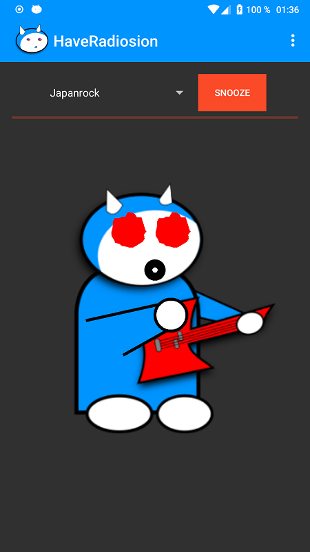

# HaveRadiosion

Internet radio player with comic figure as music visualizer.

This app plays internet radio streams. The app is a fork of the WebRadio
app - but with a changed editor, a focus on rock music and a comic
music visualization. The design of the app has been renewed and some
new features and corrections have been added (night mode, power
saving, Notification Channel since android 8). By modifying the code
a backwards compatibility back to Android 4.1 was reached.

A signed APK file can also be found [here](https://raw.githubusercontent.com/no-go/StreamRadio/master/app/release/click.dummer.have_radiosion.apk).
SHA1 `a2d34276db342f1ee12a3723a48560ef546e3324`

Credits to

- [Starcommander](https://github.com/Starcommander) for the original [WebRadio](https://github.com/Starcommander/StreamRadio).
- [GautamChibde](https://github.com/GautamChibde) for awesome [BaseVisualizer.java](https://github.com/GautamChibde/android-audio-visualizer).

