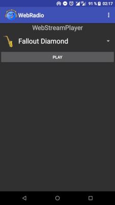
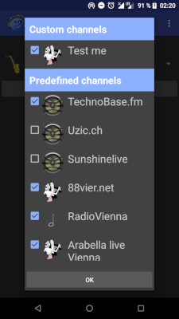
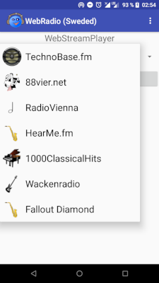

# StreamRadio (Sweded)

This App plays network radio channels on Android.

Add your custom channels to list.

A day (and night) mode is added (Day: 6:00-17:59)

Some predefined channels are already selectable.
The predefined List: `app/src/main/res/raw/channel_list.properties`

It is a fork of [StreamRadio](https://github.com/Starcommander/StreamRadio) but with a bit newer style. I call it "geschwedet".

## Get the App

You can get a signed APK (4.4.4+) from [here](https://raw.githubusercontent.com/no-go/StreamRadio/master/app/release/starcom.snd.geschwedet.apk)
